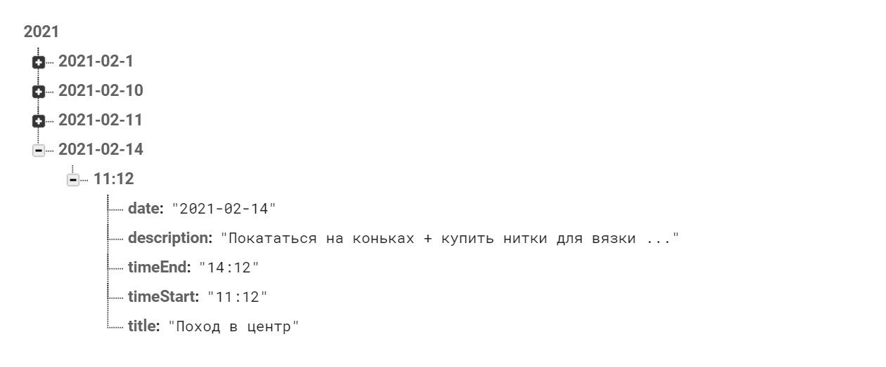

## ComeOnDoIt!
### Меня зовут Алеся Демянчук, я студентка 2 курса ФИСТ УлГТУ по направлению "Программная инженерия".
### Come on do it! - это приложение ежедневник с календарём и мое первое самостоятельное творение. 
### В приложении можно добавлять новые дела, отслеживать список текущих дел и также есть возможность посмотреть подробное описание дела.
### Использованные технологии: Kotlin, Realtime Database Firebase, Git, СollapsibleCalendar
#### Скрины с текущим состоянием работы приложения:

#### В выбранном мною календаре есть сложности с получением выбранной даты. Текущий день получить легко, и данные будут верными, а вот с выбором другого дня и получением этой даты для запроса к базе пока проблематично. Из-за этого адаптер списка задач не всегда получает корректные данные ( в SelectedDay приходит что-то не совсем понятное, поэтому календарь пока что получает Current day). Боролась с этой проблемой, пока решить не получилось. Также не получилось разобраться с построением таблицы списка дел ( именно как связать сетку TimeGrid с часовыми интервалами со списком задач).
#### Планы на будущее : улучшить работу с бд, скорректировать работу c выбором дня, потестировать на знакомых, добавить фичи.
